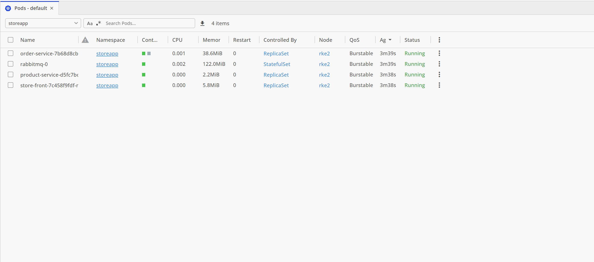

# Microservices Deployment to Local Kubernetes


## Branching Strategy

- **dev:** This branch contains the code and configuration for the web application. Changes to this branch trigger the web application deployment pipeline.
- **main:** This branch contains the simulation-ready configuration for the Spark operator and related MLOps components. Changes to this branch trigger the MLOps deployment pipeline.

## Infrastructure as code repo:

https://github.com/arturivan/cloudinfra/tree/main

# Overview

I deployed a microservices-based store application to my local Kubernetes cluster. The application consists of four services according the quickstart template:

- Storefront: Web application for customers to view products and place orders.
- Product Service: Provides product information.
- Order Service: Manages order placement.
- RabbitMQ: Message queue for handling order processing.

The source code comes from the Azure-Samples/aks-store-demo repository.

# Local Testing & Deployment

- Selected the necessary folders.
- Built images from Docker files locally, tagged them and pushed to Azure Container Registry
- Used docker-compose-quickstart.yml to test the application in Docker.
- Modified aks-store-quickstart.yaml to fit local Kubernetes deployment.
- Created Namespace storeapp
- Deployed the microservices locally

Image Pull Secret for ACR

- Created Kubernetes secret for Azure Container Registry, resolved image pull error - logs are in the repository

```
kubectl create secret docker-registry my-registry-secret \
  --docker-server=<your-registry-server> \
  --docker-username=<your-username> \
  --docker-password=<your-password>
```

- updated the manifest file with imagePullSecrets fields and added correct path to image:

```
restartPolicy: Always
      imagePullSecrets:
        - name: acr-secret
      containers:
        - name: rabbitmq
          image: azdevops77.azurecr.io/rabbitmq:3.13.2
          imagePullPolicy: Always
```

- Created Kubernetes secrets for RABBITMQ_DEFAULT_USER and ORDER_QUEUE_USERNAME. The manifest now references the Kubernetes secrets

```
kubectl apply -f secrets.yml

example:

env:
            - name: RABBITMQ_DEFAULT_USER
              valueFrom:
                secretKeyRef:
                  name: rabbitmq-credentials
                  key: username
            - name: RABBITMQ_DEFAULT_PASS
              valueFrom:
                secretKeyRef:
                  name: rabbitmq-credentials
                  key: password
```

Fixing RabbitMQ Deployment Issues

- Solved Erlang syntax error and failed deployments - a dot was missing and Rabbitmq could not start fully

```
apiVersion: v1
data:
  rabbitmq_enabled_plugins: |
    [rabbitmq_management,rabbitmq_prometheus,rabbitmq_amqp1_0].
kind: ConfigMap
metadata:
  name: rabbitmq-enabled-plugins
```

- Defined namespace creation

- Deployed the microservices locally

```
kubectl apply -f namespace.yaml
kubectl config set-context --current --namespace=storeapp
kubectl apply -f appstore.yaml
```

- Checked the status of deployed microservices in Lens dashboard and used kubectl to check the store-front Loadbalancer:

```
kubectl get svc store-front
```

- Used kubectl port-forward to access the service locally

```
kubectl port-forward svc/store-front 8080:80
http://localhost:8080
```

The status of services in Lens Dashboard:



# Deployment from GitHub Actions

The GitHub Actions workflow automates the deployment of microservices to a local Kubernetes cluster over a Tailscale VPN.

Key Features:

Secure Kubernetes Access:

The GitHub runner connects to the cluster using Tailscale VPN.
A SAN certificate was issued to allow the Tailscale IP to authenticate via kubeconfig.
The kubeconfig file is stored securely as a base64-encoded GitHub secret.

CI/CD Workflow:

Build Stage:

- Uses Docker Buildx for multi-platform support.
- Builds and pushes container images to Azure Container Registry (ACR).
- Supports caching to speed up subsequent builds.

Deployment Stage:

- Establishes a secure Tailscale connection.
- Installs kubectl and configures it using the stored kubeconfig.
- Lints Kubernetes manifests before deployment to catch errors early.
- Deploys services using kubectl apply.
- Monitors rollout status to ensure successful deployment.
- Implements an automatic rollback mechanism in case of failure.
