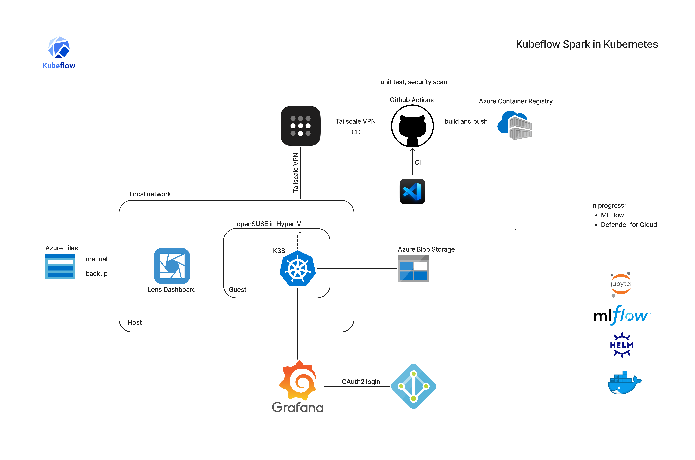
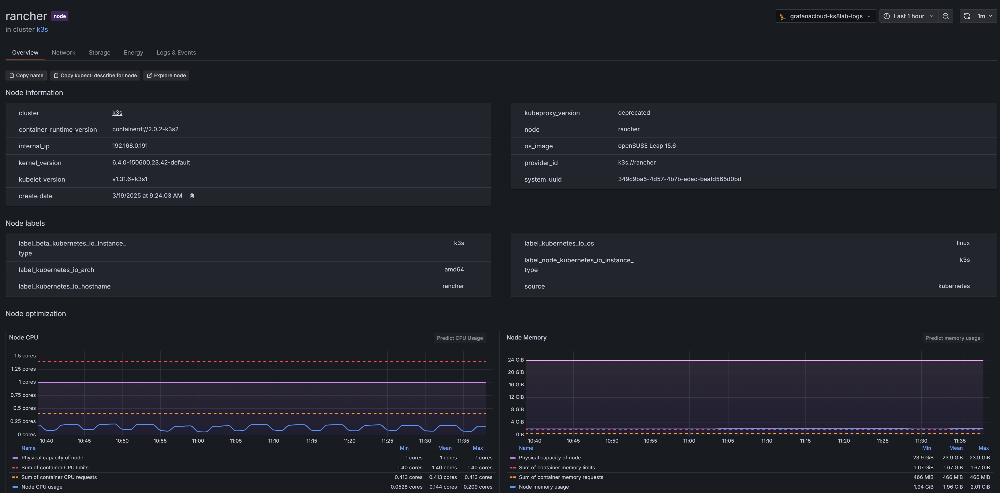

# Kubernetes lab

## Branching Strategy

- **main:** This branch contains the simulation-ready configuration for the Spark operator and related MLOps components. Changes to this branch trigger the MLOps deployment pipeline.
- **dev:** This branch contains the code and configuration for the web application. Changes to this branch trigger the web application deployment pipeline.

**Infrastructure as code repo:**

moving to Azure Devops:
https://dev.azure.com/ks8labs/_git/azureinfra?path=%2F&version=GBtest&_a=contents

https://github.com/arturivan/cloudinfra/tree/main

**Gitops**

Planning to migrate my applications to a GitOps repository with Flux for automated deployments.

Exploring event monitoring and analysis in local Kubernetes environment using Vector and Redis: 
https://github.com/arturivan/gitops

https://hub.docker.com/r/timberio/vector

**PySpark project**

I built a secure CI/CD pipeline to automate deployments for Apache Spark jobs using the Kubeflow Spark Operator on Kubernetes (K3S). This project focuses on secure ML pipelines, scalable data transformations, and cloud-native orchestration.

Tech Stack & Tools:

- Kubernetes (K3S) – Cluster orchestration
- Kubeflow Spark Operator – Managing Spark workloads on Kubernetes
- Apache Spark – Distributed data transformations
- GitHub Actions – CI/CD for automated Spark job deployment
- Tailscale – Secure cluster access
- Azure Entra ID – Authentication and IAM
- Grafana Cloud and Lens – Monitoring

Key Highlights:

- Created a hardened openSUSE Leap in Hyper-V and set up an K3S Kubernetes cluster
- Automated Spark job deployments using the Kubeflow Spark Operator
- Integrated GitHub Actions for secure and efficient CI/CD workflows
- Used Azure Container Registry for managing and securing container images
- Stored transformed data in Azure Storage for scalability and accessibility
- Configured Azure Files for backup of the Kubernetes cluster
- Used Tailscale for secure remote access to the cluster
- Implemented IAM integration and security best practices with Grafana Cloud and Azure Entra ID
- Designed for scalability, allowing efficient Spark job execution on Kubernetes

**Kubeflow Spark Pipeline**

This GitHub Actions pipeline automates the CI/CD process for deploying a Spark-based text transformation application on Kubernetes using Kubeflow. The pipeline is triggered when changes are pushed to the main branch within the src/ directory.

**Pipeline Overview**

**Build Phase**

- Checkout Code: Retrieves the latest changes from the repository.
- Azure Authentication: Logs into Azure and Azure Container Registry (ACR).
- Docker Image Build & Push: Builds the Spark application container.
- Pushes the image to ACR.

**Deployment Phase**

- Tailscale Setup: Establishes a secure connection to a private Kubernetes cluster.
- Kubectl Configuration: Installs kubectl.
- Configures access using the stored KUBECONFIG.

Manifest Validation & Deployment:

- Performs a dry-run validation of spark-app.yaml.
- Deploys the Spark job to Kubernetes.
- Automatic Rollback: If the deployment fails, the pipeline triggers a rollback of the application.

Key Features

- Secure authentication with Azure and Tailscale
- Automated Docker image building and registry integration
- Kubernetes manifest validation before deployment
- Automatic rollback on failure for reliability

This pipeline ensures a smooth and automated workflow for deploying Spark jobs in a Kubernetes environment with minimal manual intervention.

**Grafana Cloud Dashboard**

